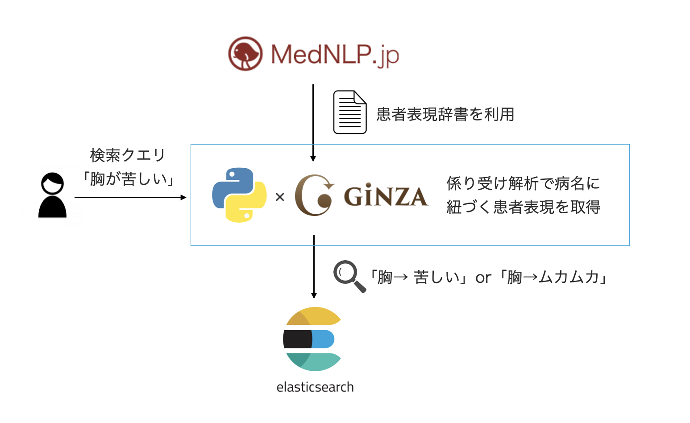

# symptom-expression-search

ElasticsearchやGiNZA、患者表現辞書を使った患者表現揺れ吸収する意味構造検索を試した



## Quick Start

```bash
$ docker-compose up -d

$ cd symparser
$ poetry run symparser_api

# index document
$ curl -H 'Content-Type:application/json' -d '{"id": 1,"title": "胸が苦しい"}' localhost:8000/topics

# search
$ curl localhost:8000/topics/search?q=胸がムカムカ
```

